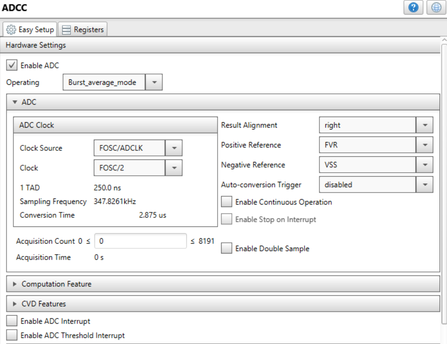

[](https://www.microchip.com)

# Weather Station with PIC18F16Q41, Curiosity Nano Base and MikroE Click boards&trade;

This project is based on the "pic18f16q40-weather-station" which used a Low Pin Count (LPC) variant of the PIC18F16Q40, LPC Baseboard (with 1 MikroE Click socket),
and breadboarded the other two MikroE Click boards&trade;. This port of that project enables the use of a Curiosity Nano Development board, with a Curiosity Nano Base board,
 which allows all three MikroE Click boards to be positioned on the base board. This project highlights the advanced communications peripherals found on the PIC18F16Q41
family of microcontrollers to create a PIC18 powered weather station, all with Microchip’s easy to use Curiosity Nano platform.
The I2C module was used to interface with a Bosch BME280 Weather Sensor to provide real-time measurements for temperature, relative humidity, and
atmospheric pressure. This project also implements the 12-bit Analog to Digital Converter with Computation (ADCC) to interface an analog ambient
light sensor which was used to measure light intensity. The SPI module was used to drive an OLED display to display the weather station output values
in real time, and the UART module was used to send the weather station output values over
a serial port in real time.


## Related Documentation

 The original project this was ported from can be found at the following link:
<https://github.com/microchip-pic-avr-examples/pic18f16q40-weather-station>

## Software Used

- [MPLAB® X IDE 5.50 or newer](https://www.microchip.com/en-us/tools-resources/develop/mplab-x-ide?utm_source=GitHub&utm_medium=TextLink&utm_campaign=MCU8_MMTCha_pic18q41&utm_content=pic18f16q41-weather-station-cnano-mplab-mcc-github)
- [MPLAB XC8 2.32 or newer](https://www.microchip.com/en-us/tools-resources/develop/mplab-xc-compilers?utm_source=GitHub&utm_medium=TextLink&utm_campaign=MCU8_MMTCha_pic18q41&utm_content=pic18f16q41-weather-station-cnano-mplab-mcc-github)
- [MPLAB Code Configurator (MCC) 3.95.0](https://www.microchip.com/en-us/tools-resources/configure/mplab-code-configurator?utm_source=GitHub&utm_medium=TextLink&utm_campaign=MCU8_MMTCha_pic18q41&utm_content=pic18f16q41-weather-station-cnano-mplab-mcc-github)
- [MPLAB Code Configurator (MCC) Device Libraries PIC10 / PIC12 / PIC16 / PIC18 MCUs](https://www.microchip.com/en-us/tools-resources/configure/mplab-code-configurator?utm_source=GitHub&utm_medium=TextLink&utm_campaign=MCU8_MMTCha_pic18q41&utm_content=pic18f16q41-weather-station-cnano-mplab-mcc-github)
- [Microchip PIC18F-Q Series Device Support (1.4.109) or newer](https://packs.download.microchip.com/)


## Hardware Used

- [PIC18F16Q41 Curiosity Nano Evaluation Kit (EV26Q64A)](https://www.microchip.com/en-us/development-tool/EV26Q64A?utm_source=GitHub&utm_medium=TextLink&utm_campaign=MCU8_MMTCha_pic18q41&utm_content=pic18f16q41-weather-station-cnano-mplab-mcc-github)
- [Curiosity Nano Base for Click boards (AC164162)](https://www.microchip.com/en-us/development-tool/AC164162?utm_source=GitHub&utm_medium=TextLink&utm_campaign=MCU8_MMTCha_pic18q41&utm_content=pic18f16q41-weather-station-cnano-mplab-mcc-github)
- [OLED C Click board (MIKROE-1585)](https://www.mikroe.com/oled-c-click)
- [Weather Click board (MIKROE-1978)](https://www.mikroe.com/weather-click)
- [Ambient Click board (MIKROE-1890)](https://www.mikroe.com/ambient-click)


## Setup

The PIC18F16Q41 Curiosity Nano Evaluation Kit [(Part # EV26Q64A)](https://www.microchip.com/en-us/development-tool/EV26Q64A?utm_source=GitHub&utm_medium=TextLink&utm_campaign=MCU8_MMTCha_pic18q41&utm_content=pic18f16q41-weather-station-cnano-mplab-mcc-github) was selected as the development platform for this code example. The weather station display was implemented using the MikroElektronika [OLEDC Click board (MIKROE-1585)](https://www.mikroe.com/oled-c-click), the Bosch BME280 environmental sensor was provided using the [Weather Click Board (MIKROE-1978)](https://www.mikroe.com/weather-click), and the ambient light sensor was provided using the [Ambient Click Board (MIKROE-1890)](https://www.mikroe.com/ambient-click). The Curiosity Nano base board has three Click sockets. The layout of Click boards is as follows:
- Socket 1: OLED C Click
- Socket 2: Weather Click
- Socket 3: Ambient Click

No additional wiring is required for this example.

|	Signal						  |	Microcontroller Pin |
|---------------------------------|---------------------|
|  UART TX						  |	RB7					|
|  Weather Click – SDA (I2C)	  |	RB4					|
|  Weather Click – SCL (I2C)	  |	RB6					|
|  OLEDC Click – SDO (SPI)		  |	RC5					|
|  OLEDC Click - SDI (SPI)		  |	RC4					|
|  OLEDC Click – SCK (SPI)		  |	RC6					|
|  OLEDC Click – nCS (SPI)		  |	RC7					|
|  OLEDC Click – DC				  |	RC1					|
|  OLEDC Click – EN				  |	RA4					|
|  OLEDC Click – RST			  |	RA5					|
|  OLEDC Click – RW				  |	RC3					|
|  Ambient Click Output			  |	RC2					|

Be aware, that the Q41 Curiosity Nano will generate an associated UART Rx when the UART Tx is created. The user must ensure the Rx pin generated is not used as an I/O to avoid unexpected behavior.
<br> <br>
To use a serial terminal with this project, set it to 9600 baud, no parity, 1 stop bit.


<br> <br>


## Operation

The I2C module was used in this code example to communicate with the Bosch BME280 weather sensor to measure temperature, pressure,
and relative humidity. For this example, the I2C module was initialized using the MPLAB Code Configurator (MCC). The I2C was configured
to operate with a standard clock speed of 100 kHz, and since the Weather Click board incorporates pull-ups, no external pull-up resistors
were required on the SDA and SCL pins. The client address of the BME280 weather sensor was the default address of 0x76. The temperature,
pressure, and humidity measurements were acquired from the Bosch BME280 weather sensor as raw uncompensated outputs.

### BME280 Weather Sensor Compensation Routines:
The I2C module was used in this example to read the temperature, pressure, and humidity from the BME280 sensor. The temperature and
pressure are read as 20-bit unsigned values, and the relative humidity is read as a 16-bit unsigned value. These sensor measurements obtained
using the I2C module are raw data measurements from the weather sensor, and compensation routines must be used to convert the raw sensor
outputs to values that can be used for display. The BME280 weather sensor has a set of compensation parameters stored in the device memory
that must be read and stored by the PIC&reg; microcontroller. These compensation parameters are all used in the conversion routines to properly
convert the raw sensor output to the final output results. The compensation routines are used to convert the BME280 raw outputs to temperature
in degrees Celsius, atmospheric pressure in hectopascals (equivalent to millibar), and relative humidity. The atmospheric pressure is adjusted
in accordance with the International Standard Atmosphere to take into account the elevation at the user's location (set manually by the user
with the ELEVATION macro in the bme280.h header file).
The compensation routines are shown below.

These compensation routines were obtained from the [Bosch BME280 datasheet](https://www.bosch-sensortec.com/products/environmental-sensors/humidity-sensors-bme280/).


### Temperature Compensation Routines (°C):  
```
static uint32_t BME280_compensateTemperature(void) {
    long tempV1, tempV2, t;

    tempV1 = ((((adc_T >> 3) - ((long) calibParam.dig_T1 << 1))) * ((long) calibParam.dig_T2)) >> 11;
    tempV2 = (((((adc_T >> 4) - ((long) calibParam.dig_T1)) * ((adc_T >> 4) - ((long) calibParam.dig_T1))) >> 12)*((long) calibParam.dig_T3)) >> 14;
    t_fine = tempV1 + tempV2;
    t = (t_fine * 5 + 128) >> 8;

    return t;
```
### Atmospheric Pressure Compensation Routine (in Pascals):
```
static uint32_t BME280_compensatePressure(void) {
    long pressV1, pressV2;
    uint32_t p;

    pressV1 = (((long) t_fine) >> 1) - (long) 64000;
    pressV2 = (((pressV1 >> 2) * (pressV1 >> 2)) >> 11) * ((long) calibParam.dig_P6);
    pressV2 = pressV2 + ((pressV1 * ((long) calibParam.dig_P5)) << 1);
    pressV2 = (pressV2 >> 2)+(((long) calibParam.dig_P4) << 16);
    pressV1 = (((calibParam.dig_P3 * (((pressV1 >> 2) * (pressV1 >> 2)) >> 13)) >> 3) +
            ((((long) calibParam.dig_P2) * pressV1) >> 1)) >> 18;
    pressV1 = ((((32768 + pressV1))*((long) calibParam.dig_P1)) >> 15);

    if (pressV1 == 0) {
        // avoid exception caused by division by zero
        return 0;
    }

    p = (((uint32_t) (((long) 1048576) - adc_P)-(pressV2 >> 12)))*3125;
    if (p < 0x80000000) {
        p = (p << 1) / ((uint32_t) pressV1);
    } else {
        p = (p / (uint32_t) pressV1) * 2;
    }

    pressV1 = (((long) calibParam.dig_P9) * ((long) (((p >> 3) * (p >> 3)) >> 13))) >> 12;
    pressV2 = (((long) (p >> 2)) * ((long) calibParam.dig_P8)) >> 13;
    p = (uint32_t) ((long) p + ((pressV1 + pressV2 + calibParam.dig_P7) >> 4));

    return p;
}
```

### Relative Humidity Compensation Routine (%):
```
static uint32_t BME280_compensateHumidity(void) {
    long humV;
    uint32_t h;

    humV = (t_fine - ((long) 76800));
    humV = (((((adc_H << 14) - (((long) calibParam.dig_H4) << 20) - (((long) calibParam.dig_H5) * humV)) +
            ((long) 16384)) >> 15) * (((((((humV * ((long) calibParam.dig_H6)) >> 10) *
            (((humV * ((long) calibParam.dig_H3)) >> 11) + ((long) 32768))) >> 10) +
            ((long) 2097152)) * ((long) calibParam.dig_H2) + 8192) >> 14));
    humV = (humV - (((((humV >> 15) * (humV >> 15)) >> 7) * ((long) calibParam.dig_H1)) >> 4));
    humV = (humV < 0 ? 0 : humV);
    humV = (humV > 419430400 ? 419430400 : humV);

    h = (uint32_t) (humV >> 12);
    return h;
}
```

### ADCC Module Configuration:
The ADCC was used in this code example to measure the output of the ambient light sensor. This peripheral was configured in Burst-Average mode
for this sensor interface, which allows the ADC to core independently perform a pre-determined burst of conversions while accumulating the
conversion results. In Burst-Average mode once the specified number of conversions have been completed, the accumulated sum of the conversion
results is then right shifted (or divided) by the specified number of bits core independently. The purpose of this hardware feature is to allow
the ADC to perform averaging without any software intervention. The right shifted result can be read from the ADFLTR register.

The ADC conversion result was then used to calculate the ambient light intensity in µW/cm2 using the characteristic curve provided in the sensor
datasheet. The following code snippet shows the firmware used to perform the burst-average conversion on the ambient light sensor output, and
the compensation routine used to convert the raw analog value to light intensity. MPLAB Code Configurator was used to quickly and easily
setup the ADCC module for this sensor interface. The setup and configuration of the ADCC using MCC is shown in the figure below. The ADCC
was configured to perform 32 burst average conversions and then right shift them by 5 (divide by 32).

### ADCC Burst-Average Mode MCC Configuration:
  
<br> <br>


### ADCC Computation Feature MCC Configuration:


### Ambient Light Sensor Acquisition & Compensation:
```
float Ambient_ReadSensor(void) {
    ADPCH = AMBIENT; // Select AMBIENT analog channel as ADCC positive input;
    ADCON0bits.ADGO = 1; // Trigger burst-average ADCC conversions;
    while (ADCON0bits.ADGO); // Wait for ADC Threshold Interrupt Flag to set;
    while (!PIR2bits.ADTIF); // Wait for ADC Threshold Interrupt Flag to set;
    return (ADCC_GetFilterValue()); // Return ADC Burst Average Result;
}

float AmbientCompensation(void) {
    float Ambient_Raw, Ambient_Volt, Light_Intensity;
    Ambient_Raw = Ambient_ReadSensor();
    Ambient_Volt = (Ambient_Raw / ADCC_RESOLUTION)*(ADCC_POS_REFERENCE); // Calculate ADC voltage using conversion result;
    Light_Intensity = (POLY1_TERM1 * Ambient_Volt) + POLY1_TERM0; // Calculate ambient light intensity;
    return (Light_Intensity); // Return light intensity (uW/cm^2);
}
```

### SPI Module Configuration:
The SPI module was used in this code example to communicate with the OLEDC display to show the real-time weather station
output results. The OLEDC library in MCC was used to generate the initialization code and functional APIs needed to use
the display. The library sets up the SPI module with the correct configuration to ensure proper communication between
the PIC microcontroller and the display driver, and also provides a set of functional APIs that make getting started with
the display quick and easy. To add the OLEDC library to an MPLAB X project, open MCC and navigate to the "Device Resources"
section. Once inside the Device Resources section, select the “Mikro-E Clicks” drop down menu, select “Displays”, and then
add in the "oledC" library. The functional APIs provided by the oledC library in MCC handle all of the SPI communication
between the PIC and the display driver.


### UART Module Configuration:
The UART module was used in this code example as an alternative way of displaying the weather station output results by printing
the temperature, pressure, humidity, and ambient light intensity periodically using a serial port. The UART module was configured
using MCC in **Asynchronous 8-bit mode** with a **baud rate of 9600, No Parity, 1 Stop Bit.**  **Transmission and reception were both enabled**, and the
**“Redirect STDIO to UART” checkbox was selected** under the software settings tab to include the library required for “printf” functions.
The UART TX pin was selected as pin RB7.


### Weather Station Serial Port Output Results on MPLAB Data Visualizer:


## Summary

This example shows how to create a weather station using the PIC18F16Q41 using MikroE Click boards.
